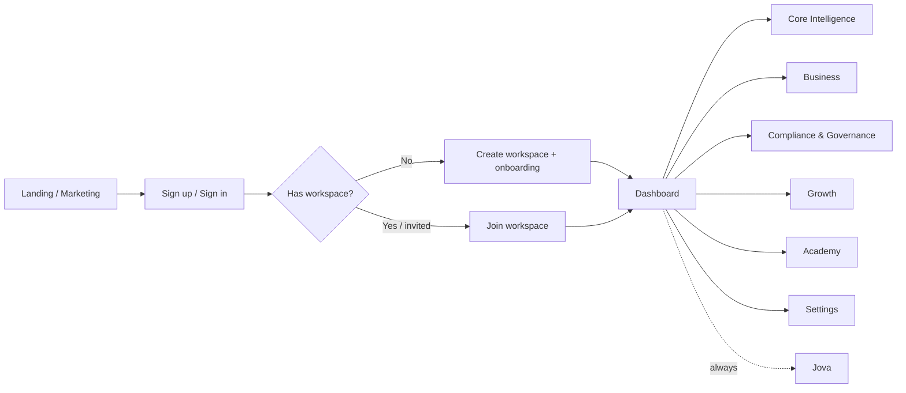
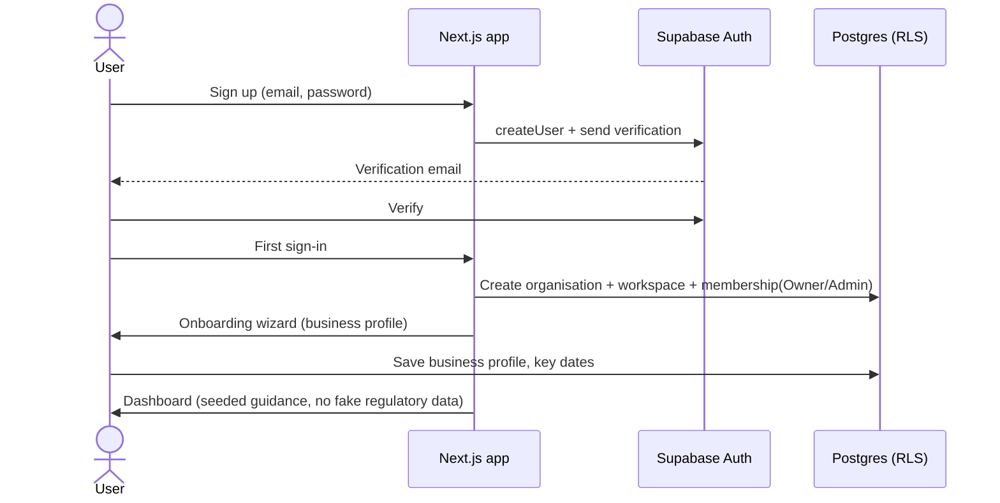
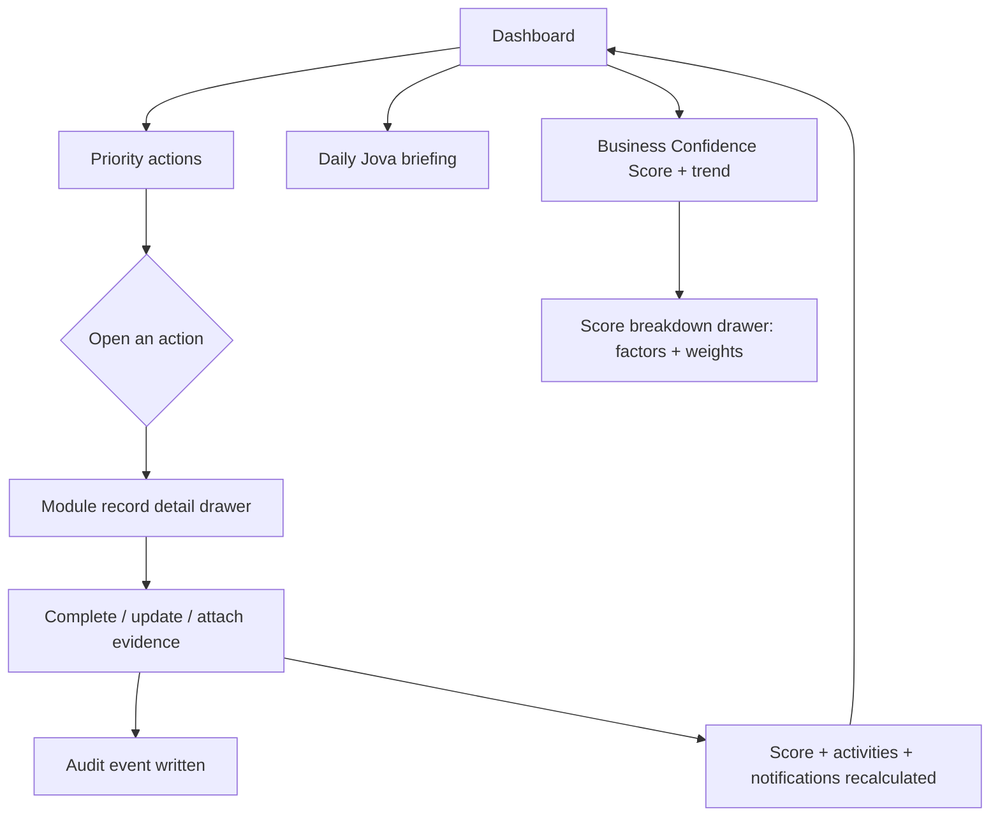
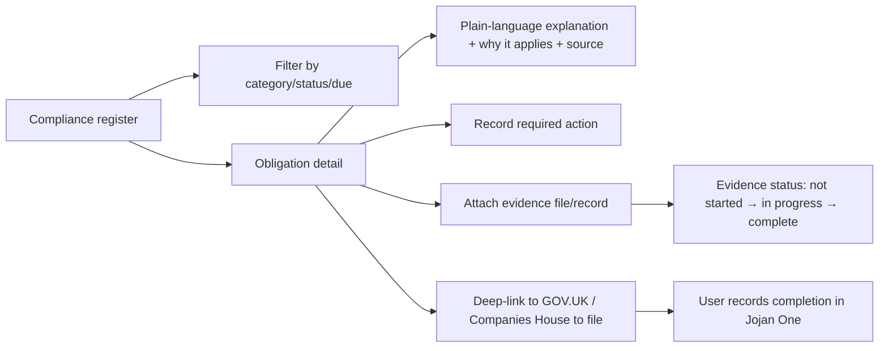
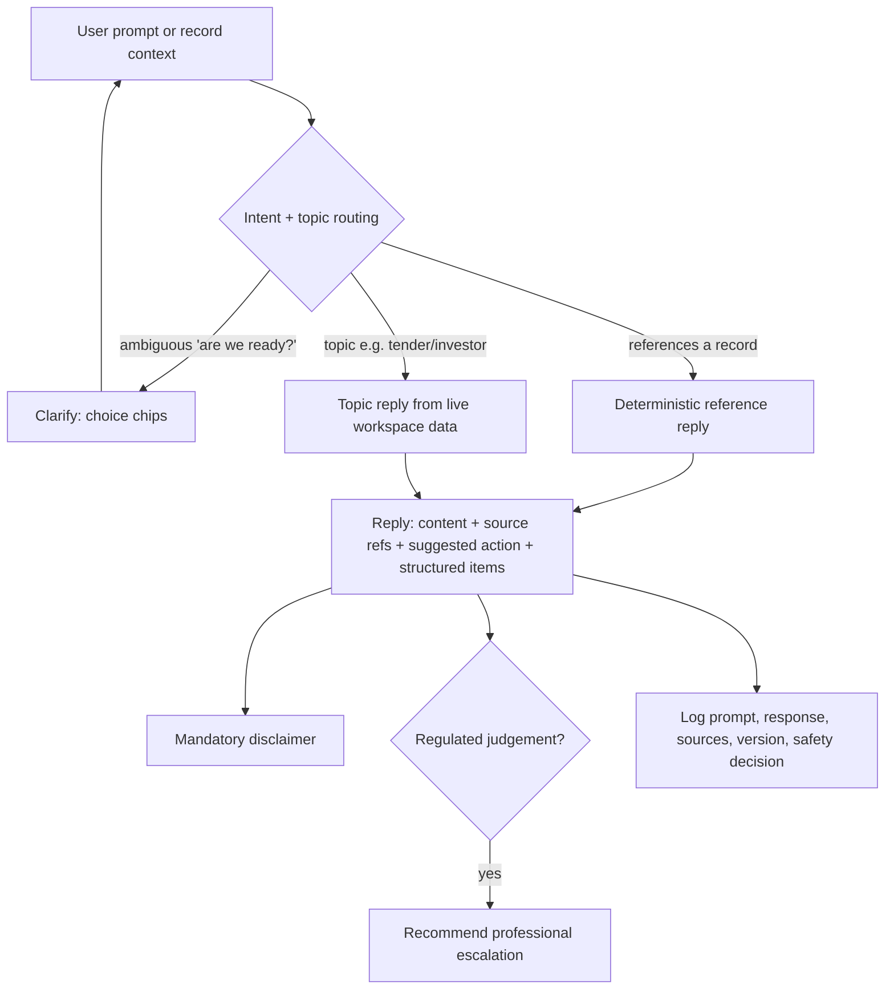
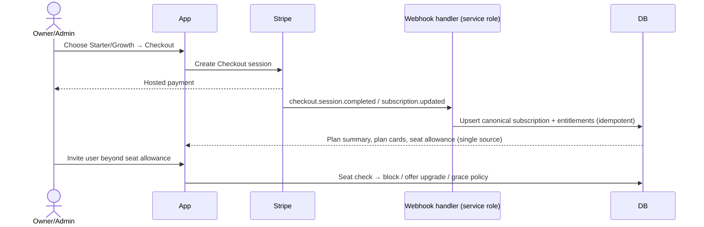

# 04 — App Flow

**Product:** Jojan One · **Companion docs:** [PRD](./01-PRD.md), [UI/UX](./03-UI-UX-Design.md)

End-to-end journeys and navigation. Diagrams use Mermaid.

---

## 1. Top-level navigation map

## 2. Authentication & onboarding

**Onboarding wizard (first workspace):**
1. Business basics — name, company number, type, industry, incorporation date, addresses.
2. Operating context — VAT/employer registration, processes personal data?, trades
   internationally?, employee/contractor counts. These answers drive obligation
   applicability and Jova routing.
3. Optional Companies House lookup to pre-fill profile (labelled with source + retrieval
   time).
4. Land on Dashboard with a clear first-run state and suggested first actions.

**Invited user:** invite email → accept → join existing workspace with the assigned role →
role-appropriate landing (Team Member sees assigned records/training; Adviser sees scoped
areas only).

## 3. Core daily loop (Dashboard → action → resolution)

The Business Confidence Score is always **explainable** — the breakdown drawer shows each
`ConfidenceFactor` (label, score, weight, contributing module).

## 4. Representative module flows

### 4.1 Compliance (obligations)

No filing happens inside Jojan One — the app deep-links out and records the outcome + evidence.

### 4.2 Contracts
Register → detail → key terms/obligations → **renewal & notice tracking** → reminder before
notice window → optional linked entity/risk.

### 4.3 HR
Employees register → right-to-work / probation / policy-ack / training status →
auto-generated **HR actions** with due dates → complete + evidence.

### 4.4 Risk
Risk register → inherent score (likelihood × impact) → controls + effectiveness → residual
score → mitigation actions with owners/dates → accept/close with documented reason; risks
link to obligations, contracts, employees, processing activities, governance records.

### 4.5 GDPR
Health check → gaps + recommendations → ROPA (processing activities) → DSAR handling
(received → verify identity → due date → complete) → breach log (contain → assess →
notify decision) → DPIA → privacy notice versions.

### 4.6 Simulator (Scenario)
Pick scenario (hire, contractor, new customer/supplier, launch website, expand market,
raise investment, prepare tender, introduce AI, new personal data) → answer questions →
deterministic result: readiness, impact, affected modules, considerations, risks, **required
actions with target modules**, recommended documents, suggested deadlines, professional
support → save run → actions flow into the relevant modules.

### 4.7 Investor Ready
Investor profile → readiness assessment (category scores) → due-diligence register (missing
→ in progress → ready) → data room folders → readiness score. Items can source from other
modules' records.

### 4.8 Tender Ready
Opportunity → **Bid/No-Bid assessment** (scored, but the decision is the user's) →
requirements (mandatory/weighted) → responses (draft → review → approved) → evidence library
→ submission checklist → deep-link/hand-off (no portal submission at launch).

### 4.9 Academy
Library → assign course (to owner/employee, with due date, company/legal-required flags) →
learner: lessons → progress → quiz (answers hidden until submit) → pass → **certificate**
(non-accreditation wording). Jova can explain any course in plain English and recommend
courses based on current business gaps.

## 5. Jova interaction flow

Jova reads **only** the caller's workspace (RLS-bound), never invents external status, and
always attaches the disclaimer. Every exchange is logged.

## 6. Reports & exports

Choose report type (executive summary, business confidence, compliance overview, risk
summary, monthly activity, training summary) → generate from live records → preview
(print-safe) → export/share → optionally schedule. Exports and safety notices are never
paywalled.

## 7. Billing & plan lifecycle

- One canonical subscription record drives every plan-aware screen.
- Professional/Enterprise show "Coming later" / "Talk to us" — no charge until deliverable.
- Seat overage is handled explicitly (block / upgrade / grace).

## 8. Roles → landing & capability (summary)

| Role | Lands on | Can do |
|------|----------|--------|
| Owner/Admin | Dashboard | Everything incl. billing, users, exports, settings |
| Manager | Dashboard | Operational modules + reports; no billing/destructive unless delegated |
| Team Member | Assigned work / Academy | Update assigned records, complete training, add evidence |
| Adviser | Scoped area(s) | Time-limited view/comment on approved areas only |
| Read Only | Permitted records/reports | View only; export only if granted |

All capabilities above are enforced server-side; the UI merely reflects them.
