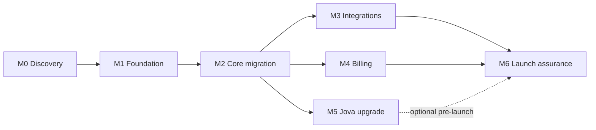

# 06 — Implementation Plan

**Product:** Jojan One · **Companion docs:** [TRD](./02-TRD.md), [Schema](./05-Backend-Schema.md)

Phased to the handover's roadmap (§14), front-loading a **trustworthy foundation** before
any government integration or AI upgrade.

---

## 0. Guardrails

- **Do not** rebuild the interface or replace working prototype logic until the audit,
  target data model, tenant/security design, integration approach and phased estimate are
  reviewed and approved.
- **First objective is a trustworthy production foundation — not live government filing.**
- Every phase ships behind separate **local / test / staging / production** environments.

## Progress (live)

_Updated 2026-07-23 (M6)._

- **Post-M6 increments:**
  - **Semantic Jova memory + persistent conversations + policy drafting** (M5 follow-on):
    - **Memory**: a **pgvector** store (`jova_memories`, `vector(384)`, HNSW cosine) with a pluggable **Embedder** — Transformers.js (`all-MiniLM-L6-v2`) in-process or a **Supabase Edge Function** (gte-small) — selected by `JOVA_EMBED_BACKEND`, gated by `JOVA_EMBEDDINGS`. Best-effort remember/recall around each turn, RLS-scoped, and never blocks or fails an answer (`verify-jova-memory.ts`, `verify-embed-edge.ts`).
    - **Conversations UI**: `/jova` is now a two-pane workspace — a conversation list (new / switch / delete, cascading to messages + sources) beside a multi-line composer with per-message copy — over the existing `conversations`/`messages` tables (`listConversations`/`deleteConversation`/`listConversationMessages`; `verify-jova-conversations.ts`, 15/15).
    - **Policy drafting**: "Draft with Jova" is a guided, template-driven flow — a catalogue of **20 policy templates** (`src/shared/policies/templates.ts`, grouped by category, plus a blank option), each with a suggested purpose, a section skeleton and **guided questions** (the first being the purpose). The owner's answers are woven into named sections and composed into a full document (active LLM provider, with a deterministic section-by-section fallback); the template also sets the category, review cadence and sign-off requirement. Saved as a **draft** to review, edit and adopt — via a `content` column on `policies`, editable on the detail page (`verify-policy-draft.ts`, 17/17).
  - **Lovable feature-parity programme (Waves 2–4)** — mirrored the prototype's per-page features onto the production stack while keeping production-only wins (RLS multi-tenancy, real members/invites, Companies House, semantic memory). Honest-data discipline throughout: deltas/scores are computed from real data or shown as unavailable, never fabricated.
    - **Wave 2 — headline pages**: Executive **CEO briefing** (management summary, decisions-required, growth-readiness from real facts, generate-executive-report); Dashboard **morning brief** + today's priorities + a **real day-over-day score delta** (`score_history`, null until history exists); Reports **generation catalogue** (6 report types), a filterable library with rename/duplicate, and a print preview featuring the business logo + particulars (`verify-score-history.ts`, `verify-executive.ts`, `verify-reports-gen.ts`).
    - **Wave 3 — Timeline + module boards**: Timeline rebuilt as a true **activity feed** (`getActivityFeed` over the `activities` trail, actor resolved to email) with time-window tabs, filters, date-grouped cards and a detail drawer, keeping the due-date calendar as an "Upcoming" tab (`verify-activity-feed.ts`, 9/9). **Six module pages** (Contracts, Compliance, Risk, HR, Governance, GDPR) enriched to a consistent board: stat tiles, search + filters, extra columns, a clickable **detail/edit drawer** (full-field inline edit), status/quick actions, and a **5×5 inherent/residual risk matrix**; shared `_shared/board-bits` primitives; two thin backend gaps closed (a Contracts `[id]` route, `listObligationEvidence`).
    - **Wave 4 — new-table subsystems** (the tables already existed canonically from M1/M2 baseline migrations; this bound them in Drizzle and surfaced them): **GDPR** now has six tabs — DSAR requests (one-month clock), breach log (72h ICO clock), DPIAs, a privacy-notice register, and a checklist-scored readiness assessment; **Business Map** gains a key-parties register (`business_entities`); **HR** gains an Actions tab (`hr_actions`); **Investor Ready** gains a fundraising profile + data-room tracker + a 7-dimension readiness assessment; **Tender Ready** gains requirements + response drafts + a 6-dimension bid/no-bid decision; **Simulator** gains decision-scenario playbooks (`scenario_runs`); **Academy** surfaces learning stats + certificates. Each is a full vertical slice (Drizzle → Zod → `withUser` service → Route Handlers → shadcn UI → verifier) with cross-tenant RLS proven — business-entities 7/7, hr-actions 7/7, gdpr-registers 15/15, gdpr-notices 11/11, investor-readiness 12/12, tender-readiness 14/14, scenarios 7/7.
    - **Policy version history** (new table `policy_versions`, migration `0022`): publishing a policy snapshots an immutable copy of its name/version/content; a version timeline on the policy detail page; re-publishing a live policy does not duplicate (`verify-policy-versions.ts`, 7/7).
  - **Policies module** (18th module, Compliance & Governance): a living policy register — versioned, owned, reviewed on a schedule, with staff sign-off tracked. Built on the proven template (Drizzle `policies` → Zod → `withUser` service → Route Handlers → shadcn page → `verify-policies.ts`) over the existing `policies` table + RLS. Promoted out of Governance into its own module.
    - **Per-employee sign-off**: a `policy_acknowledgements` roster linking policies ↔ HR employees; the policy-level status and the HR-level `policy_acknowledgement_status` flag are both auto-rolled-up from the roster (`verify-policy-ack.ts`, 20/20).
  - **Conditional onboarding**: onboarding is now a **data-driven schema** (`src/shared/onboarding/`), not one giant form — 109 fields across 14 sections, each with a stable id, data type, validation, required mode (initial / progressive / optional), conditional-display + conditional-required rules, sensitivity classification, permissions and destination module. A single schema-driven wizard renders it with **save-and-continue** (`onboarding_responses` blob keyed by field id) and gates first-time completion on the initially-required set; secrets (password, card details) are never persisted, and mapped facts sync into `business_profiles` on completion (`verify-onboarding.ts`, 26/26).
    - **Module fan-out**: on first completion, starter records are seeded across modules from the answers — compliance obligations (incl. "unsure → review" items), a risk register from insurance/continuity gaps, draft policy stubs, and a starter GDPR ROPA entry (multiselect values mapped to labels) — atomic and idempotent (`onboarding-fanout.ts`).
    - **Document upload** (first real Storage use): the Evidence library gains section-11 metadata (owner, issue date, access level) + a binary reference; the wizard's document/logo fields upload to the private `evidence` bucket via the request-scoped client (object RLS: `path = workspace_id/…`), with signed-URL downloads and delete. The uploaded workspace logo renders in the AppShell sidebar (in-app only) via an auth'd streaming route `/api/branding/logo` — no expiring signed URL; landing/auth keep the Jojan One brand (`verify-documents.ts`, 14/14, including a cross-tenant object-RLS block and logo latest-wins/RLS).
- **M0 — Discovery & audit:** ✅ done (docs, schema map, [ADR-0001](./ADR-0001-data-access.md)).
- **M1 — Production foundation:** ✅ done.
  - Supabase Postgres, 53 tables, **RLS tenant isolation** (helper fns + policies), applied to the hosted project (London).
  - Auth (Supabase Auth + `@supabase/ssr` middleware), `provision_workspace()` onboarding RPC, five-role model.
  - **Drizzle data layer** with `withUser()` (RLS-as-user) + `adminDb` ([ADR-0001](./ADR-0001-data-access.md)).
  - Private `evidence` storage bucket + object RLS.
  - **CI** ([`.github/workflows/ci.yml`](../.github/workflows/ci.yml)): format · typecheck · **adminDb-in-request-paths guard** · build · **RLS isolation verify** (runs the `verify-*` scripts against the DB when secrets are set).
  - Backups/restore: Supabase-managed PITR (verify the restore drill before launch — an M6 item).
  - _Deferred:_ separate staging/prod Supabase projects (currently one hosted project).
- **M6 — Launch assurance + email features:** 🟡 engineering done; sign-offs open.
  - **Launch-assurance artifacts:** [Security & Threat Model](./07-Security-Threat-Model.md), [Privacy & DPIA screening](./08-Privacy-and-DPIA.md), [Runbooks & Go-Live checklist](./09-Runbooks-and-Go-Live.md), and a `GET /api/health` liveness/readiness probe (DB round-trip + integration-config booleans, no secrets).
  - **Email layer:** pluggable `EmailProvider` (**Resend** adapter + **console** dev fallback), `EMAIL_PROVIDER` switch, `isEmailConfigured()`; build-now-key-later, HTML templates. Live on `RESEND_API_KEY` + `EMAIL_FROM`.
  - **Reminder email digests:** wired into the cron (`/api/cron/reminders`) — per workspace, unread notifications → owner email digest, best-effort, skipped when email isn't configured.
  - **Member-invite flow** (the M4 deferral, now unblocked): owner-only, **seat-enforced** invites over the hashed-token `invitations` table; email delivery; a **single-use, email-bound, expiring** accept flow enforcing the seat limit again at acceptance; Settings → Members invite UI + pending-invites/revoke; standalone `/invite/accept` page.
  - Verification: **20 `verify-*` scripts** (team/email/invites 16/16 with a mock transport); build green at **53/53 routes**.
  - _Open before launch (need human/tooling):_ independent security review + pen-test, rate limiting/WAF, DPAs + DPIA sign-off, PITR restore drill, staging/prod split, production secret store, full WCAG audit, load test. Tracked in docs 07–09.
- **M5 — Controlled Jova upgrade:** ✅ done (build-now-keys-later; live-provider eval drill deferred).
  - **Provider abstraction** (`LlmProvider`): one interface, two adapters — **Anthropic (Claude, default `claude-opus-4-8`, adaptive thinking)** via the official SDK, and **OpenRouter** via raw HTTP — selected by `AI_PROVIDER`, one active at a time. `isAiConfigured()` gates the model path.
  - **Retrieval** over **RLS-filtered** workspace data only (via the verified `getSnapshot`/`getJovaBriefing`/`getBusinessProfile` services) → grounded context + source refs; provider-independent.
  - **Chat flow** (`/jova` → Ask Jova tab): grounded answers with **module citations**, **refusal** handling, **[ESCALATE]** on regulated-advice requests, and a **deterministic fallback** (the launch findings engine) on no-key/refusal/empty-retrieval/error. Every turn persisted to `conversations`/`messages`/`jova_sources` with full provenance (`ai_provider`, `model_version`, `safety_decision`, `rules_version`).
  - **Eval suite (19/19, mock provider — no key needed):** provider routing, grounding, **access isolation** (retrieval never crosses tenants), refusal + escalation correctness, **prompt-injection resistance** (RLS-bounded retrieval can't leak cross-tenant data even under a hostile prompt), deterministic fallback, and audit-provenance persistence.
  - Live on `ANTHROPIC_API_KEY` (or `OPENROUTER_API_KEY` + `AI_PROVIDER=openrouter`). Verification: **19 `verify-*` scripts**; build green at **49/49 routes**.
  - _Deferred:_ live per-provider eval drill with a real key, streaming responses, richer conversation-history UI.
- **M4 — Starter/Growth billing:** ✅ done (build-now-keys-later; member-invite UI deferred).
  - **Stripe Checkout + Customer Portal** (owner-gated route handlers) and a **signature-verified webhook** that drives the canonical `subscriptions` row — **idempotent** on the unique `stripe_event_id` (replayed events recorded once, never re-applied). Handles checkout-completed, subscription updated/created/deleted, invoice paid/failed.
  - **Seats-only gating** (your decision): Starter = 1 seat, Growth = 5; every feature works on every tier. Seat accounting (used vs allowed) + a `hasSeatAvailable` hard-block primitive; Professional/Enterprise shown as "Talk to us".
  - **Never paywalled** (verified): exports, Jova findings and escalation work even when a subscription is `canceled`/`past_due`.
  - `/billing` page (plan · status · seats · Manage-billing / upgrade). Live on `STRIPE_SECRET_KEY` + `STRIPE_WEBHOOK_SECRET` + `STRIPE_PRICE_STARTER/GROWTH`.
  - Verification: **18 `verify-*` scripts** (billing 20/20 with synthetic webhook events, no keys needed); build green at **48/48 routes**.
  - _Deferred:_ member-invite/teammate flow (needs an invitations table + email — seat-enforcement primitive is ready for it), live Stripe test-key drill, proration/coupon polish.
- **M3 — First integrations:** ✅ done (email delivery deferred).
  - **Companies House** read-only lookups (profile · officers · filing history), cached per workspace with retrieval time, source-labelled, deep-linked to official filing; graceful "not configured / stale / 404" handling. Live on `COMPANIES_HOUSE_API_KEY` (build-now-key-later).
  - **Reminder engine** over dated items (obligations, renewals, reviews, RTW expiries, tender deadlines, training) → **in-app notifications** (header bell + feed, mark-read), idempotent; a **secured `POST /api/cron/reminders`** (CRON_SECRET) drives it, ready for Supabase `pg_cron` `net.http_post`.
  - **Evidence confirmation workflow**: complete a compliance obligation _with_ a linked evidence-library record, atomically (status + evidence-status + timestamp + audit event); dated **Evidence library** page.
  - Verification: **17 `verify-*` scripts**; build green at **44/44 routes**.
  - _Deferred:_ email delivery of reminders (in-app first; provider TBD), live CH-key drill, Storage file upload for evidence binaries.
- **M2 — Core product migration:** ✅ done.
  - Next.js App Router app, AppShell (sidebar + mobile drawer), brand logo + favicon, shadcn primitives + toasts.
  - **All 17 modules** end-to-end on the proven template (Drizzle → Zod → `withUser` service → Route Handlers → shadcn page → verify script): Contracts, Compliance, Risk, HR, GDPR, Governance, Dashboard (**Business Confidence Score**), Investor Ready, Tender Ready, Settings, Executive, Timeline, Business Map, Simulator, Academy, Reports, **Jova** (deterministic rules engine).
  - Cross-cutting done: **audit-event writes** (atomic, wired into all 9 register modules; Recent-activity feed on Executive), **Reports/export** (board pack + 9-dataset CSV export), **bulk import** (CSV preview→commit for contracts/people/obligations, schema-validated, audit-logged), **a11y baseline** (skip link, focus-visible rings, `aria-current`/`aria-pressed`, keyboard-reachable file input, semantic tables), **deterministic Jova** (explained, prioritised findings over live data; Phase-2 LLM will sit on top).
  - Verification: **13 `verify-*` scripts** exercise real 2-tenant CRUD + RLS isolation against hosted Supabase; production build green at **39/39 routes**; typecheck + prettier clean.
  - _Deferred to later milestones:_ Companies House / Stripe / email integrations, Edge Function + `pg_cron` scheduled jobs, Phase-2 Jova LLM (pluggable Anthropic/OpenRouter), shell-less print route for clean PDF board packs.

---

## Milestone 0 — Discovery & audit (P0)

**Goal:** confirm scope, architecture, and estimate before building.

- Repository audit; map the prototype's `CoreDataState` → target schema.
- Architecture Decision Record: **Next.js + Supabase (London region)**, RLS-first tenancy.
- Integration feasibility: Companies House, Stripe, email, (future) AI.
- Migration plan (reference content vs. demo data), risk register, confirmed estimate.

**Exit:** signed-off ADR, data map, migration plan, risk register, estimate.

## Milestone 1 — Production foundation (P0)

**Goal:** the trustworthy base everything else stands on.

- Next.js App Router scaffold; port shadcn/ui, Tailwind theme, brand tokens, `AppShell`.
- **API scaffold in Route Handlers** (`app/api/*`, Node runtime): session middleware,
  **Drizzle `withUser()` (RLS-as-user) + `adminDb`** ([ADR-0001](./ADR-0001-data-access.md)),
  Zod validation, typed error envelope, and Supabase Edge Functions + `pg_cron` for scheduled
  jobs. _(Data layer already scaffolded in `src/server/db`.)_
- Port framework-free logic **into Route Handlers**: `*-selectors.ts`, scoring,
  `jova-engine.ts` (data source swapped to Supabase).
- **Supabase:** Auth (email/password, verification, reset, recovery, MFA); Postgres with
  the tenancy core (`organisations`, `workspaces`, `memberships`, `invitations`) + helper
  functions; **RLS on every tenant table**.
- Secure **Storage** buckets (private, signed URLs, MIME/size validation, scan hook).
- **Server permissions** for all five roles; adviser scoping + expiry.
- Secrets management; CI/CD (lint, typecheck, tests); backups + **tested restore**.
- **Tenant-isolation test suite** (the launch-gate matrix in the schema doc) started here.

**Exit:** a user can register, verify, create/join a workspace, and no cross-workspace
access is possible via any vector. Restore rehearsed.

## Milestone 2 — Core product migration (P0)

**Goal:** all 17 modules working on real, persisted, audited data.

- Migrate module CRUD + workflows: Dashboard, Executive, Timeline, Reports, Jova,
  Simulator, Business Map, Contracts, HR, Compliance, GDPR, Governance, Risk,
  Investor Ready, Tender Ready, Academy, Settings.
- Business Confidence Score, activities stream, notifications — computed server-side/from
  live data, explainable via the breakdown drawer.
- Bulk **import/export** (CSV/XLSX in; versioned JSON backup out).
- Reports + **print-safe** outputs and certificates with mandatory wording.
- **Audit events** on all important mutations.
- Responsive + **accessibility baseline** (WCAG 2.1 AA) on critical journeys.
- **Jova deterministic behaviour preserved**, now reading live workspace data + logging.

**Exit:** core records persist across devices; every module's key journeys work on desktop
and mobile; mutations are audited; Jova cites live records and keeps its safeguards.

## Milestone 3 — First integrations (P1)

**Goal:** honest external enrichment, no filing claims.

- **Companies House read-only** lookup (profile/officers/filing history), cached with
  `fetched_at` + refresh controls, labelled with source + retrieval time.
- **Official filing deep-links** (GOV.UK / Companies House) with clear hand-off wording; user
  records completion + evidence in Jojan One.
- In-app **notifications** + email reminders (deadlines, renewals, reviews) via scheduled
  jobs.
- Evidence confirmation workflow.

**Exit:** CH data is honestly sourced/labelled; failures and stale data handled gracefully;
reminders fire reliably.

## Milestone 4 — Starter/Growth billing (P1)

**Goal:** self-serve subscriptions with a single source of truth.

- **Stripe Checkout + Customer Portal**; verified **webhooks** drive canonical
  `subscriptions`/`entitlements` (idempotent on event id).
- Seat handling for Growth (block / upgrade / grace on overage); Starter = 1 seat.
- Invoices, cancellation/grace flows.
- Professional/Enterprise shown as "Coming later" / "Talk to us" — no charge.
- Verify: safety notices, exports, professional-support escalation are **never** paywalled.

**Exit:** plan state + seat allowance are consistent on every screen and driven by
provider/backend state; plan changes are idempotent.

## Milestone 5 — Controlled Jova upgrade (P1/P2)

**Goal:** optionally introduce a real model — safely — without losing determinism.

- **Provider abstraction** in the API layer: one `LlmProvider` interface, two adapters —
  **Anthropic (Claude, default `claude-opus-4-8`)** and **OpenRouter** — selected by an
  `AI_PROVIDER` config flag, **one active at a time**.
- Retrieval layer over **RLS-filtered** workspace data + approved general content
  (provider-independent).
- Source citations on every claim; refusal/escalation on regulated judgement.
- **Evaluation suites** (must pass before enabling, **run per provider you ship**): intent
  routing, factual grounding, **access isolation** (no cross-tenant leakage),
  refusal/escalation correctness, prompt-injection resistance.
- Monitoring + **deterministic fallback** (the launch engine) on low confidence/empty
  retrieval.
- DPA with each AI provider; regional processing; no training on customer data.

**Exit:** the active provider passes all eval suites; provider is switchable by config;
deterministic fallback proven; safeguards and logging intact.

## Milestone 6 — Launch assurance (P0)

**Goal:** be genuinely ready for paying customers.

- Security review + threat model; privacy documents; **DPIA** where needed.
- Accessibility review; load + restore tests.
- Support runbooks; observability/alerting; go-live checklist.
- Final pass on all handover **acceptance criteria** (see [PRD §10](./01-PRD.md)).

**Exit:** all acceptance criteria met; security/privacy/accessibility signed off; launch.

---

## Sequencing & dependencies

M3, M4 and M5 can proceed in parallel once M2 lands; M5 (real-model Jova) can slip past
launch since the deterministic engine already satisfies requirements.

## Workstreams (parallelisable within milestones)

| Workstream         | Spans  | Notes                                                                      |
| ------------------ | ------ | -------------------------------------------------------------------------- |
| Platform / infra   | M1–M6  | Supabase, Vercel, envs, CI/CD, secrets, backups, observability             |
| Data & migration   | M0–M2  | Schema, RLS, import/export, reconciliation                                 |
| API / backend      | M1–M5  | Route Handlers (Drizzle`withUser` + `adminDb`), Edge Functions + `pg_cron` |
| App / modules      | M1–M3  | Next.js migration + module workflows                                       |
| Integrations       | M3–M4  | Companies House, email, Stripe                                             |
| Jova / AI          | M2, M5 | Deterministic port, then pluggable model (Anthropic / OpenRouter)          |
| Security & privacy | M0–M6  | Tenant-isolation tests, threat model, DPIA, review                         |

## Definition of Done (per module)

- Route Handlers with Zod validation; role-appropriate access enforced by RLS in Postgres
  (queried as the user).
- Loading / empty / error states; responsive; AA accessibility on key journeys.
- Important mutations write audit events.
- Files stored privately with validation + scan; signed-URL access only.
- Unit + integration + e2e tests; included in the tenant-isolation matrix.
- Jova can reference the module's records and preserves its safeguards.

## Professional deliverables (contract checklist, from handover §15)

Technical assessment + assumptions log · target architecture & data-model diagrams ·
prioritised backlog with acceptance criteria/estimates/exclusions · production code +
migrations + infra + pipeline · API/integration + webhook/security docs · migration utility

- reconciliation + rollback · automated tests (unit/integration/e2e/permissions/a11y) ·
  security & privacy pack (threat model, retention matrix, backup/restore evidence, incident
  response, data-flow inventory) · admin + user docs + handover/training · launch report
  (connected services, limitations, monitoring, support ownership, next phase).

## Risks & mitigations

| Risk                                    | Mitigation                                                                                                                                     |
| --------------------------------------- | ---------------------------------------------------------------------------------------------------------------------------------------------- |
| Next.js migration under-scoped          | Treat as an explicit M1 task; port logic verbatim, only change routing/data layer                                                              |
| Cross-tenant leak                       | RLS-first + isolation test suite as a launch gate across all vectors                                                                           |
| Over-claiming compliance/filing         | Product copy discipline; deep-link hand-offs; no "live monitoring" language                                                                    |
| Billing state drift                     | One canonical subscription record; webhook-driven, idempotent                                                                                  |
| Scope creep into HMRC/Professional tier | Keep deferred items out of launch; visible-but-not-sold                                                                                        |
| AI safety regressions                   | Deterministic default; eval suites gate any model; fallback always on; re-run evals when switching provider                                    |
| RLS bypassed by an API bug              | Route Handlers query**as the user** (per-request session client); service-role reserved for webhooks/jobs; isolation suite as launch gate      |
| Long job hits serverless timeout        | `pg_cron` + chunking; escalate to a dedicated worker/Express only if a job genuinely outgrows serverless                                       |
| Drizzle query bypasses RLS              | All tenant queries go through`withUser()`; `adminDb` is the only escape hatch (jobs/webhooks); a guard test forbids `adminDb` in request paths |

## Key decisions to confirm before build

- Confirm Next.js migration (recommended) vs. staying on TanStack Start.
- **API tier:** Next.js Route Handlers (recommended) vs. a decoupled Express service.
- **Default AI provider** (Anthropic vs. OpenRouter) and model per adapter.
- Supabase region (London) and hosting choices.
- Trial mechanics, annual discount, and the exact plan→feature entitlement matrix.
- Which prototype records migrate vs. demo-only.
- SLA, RPO/RTO, and the accessibility conformance target.
